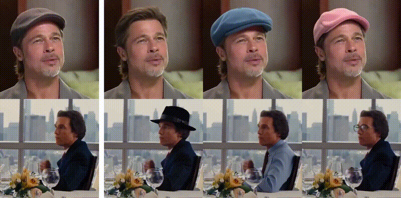

<h1 align="center">In-Context Sync-LoRA for Portrait Video Editing</h1>

<p align="center">
  <a href="http://arxiv.org/abs/2512.03013"></a>
  <a href="https://sagipolaczek.github.io/Sync-LoRA/"></a>
  <a href="https://huggingface.co/SagiPolaczek/LTX-2.3-Sync-LoRA"></a>
  <a href="https://huggingface.co/datasets/SagiPolaczek/sync-lora"></a>
</p>

<p align="center">
  
</p>

## 📰 News

- **[Dec 4, 2025]** Paper and project page released!

## Abstract

Editing portrait videos is a challenging task that requires flexible yet precise control over a wide range of modifications, such as appearance changes, expression edits, or the addition of objects. The key difficulty lies in preserving the subject's original temporal behavior, demanding that every edited frame remains precisely synchronized with the corresponding source frame. We present **Sync-LoRA**, a method for editing portrait videos that achieves high-quality visual modifications while maintaining frame-accurate synchronization  and identity consistency. Our approach uses an image-to-video diffusion model, where the edit is defined by modifying the first frame and then propagated to the entire sequence. To enable accurate synchronization, we train an in-context LoRA using paired videos that depict identical motion trajectories but differ in appearance. These pairs are automatically generated and curated through a synchronization-based filtering process that selects only the most temporally aligned examples for training. This training setup teaches the model to combine motion cues from the source video with the visual changes introduced in the edited first frame. Trained on a compact, highly curated set of synchronized human portraits, Sync-LoRA generalizes to unseen identities and diverse edits (e.g., modifying appearance, adding objects, or changing backgrounds), robustly handling variations in pose and expression. Our results demonstrate high visual fidelity and strong temporal coherence, achieving a robust balance between edit fidelity and precise motion preservation.

## 💖 Acknowledgment
We gratefully recognize the open source community whose contributions made this work possible.  
In particular, we highlight the following projects for their models, training frameworks, and valuable insights.

**[LTX-Video-Trainer](https://github.com/Lightricks/LTX-Video-Trainer/)**, which provided the training infrastructure and model implementation that supported our development.  
**[Wan2.2](https://github.com/Wan-Video/Wan2.2)**, which helped us generate high quality data through its strong generative capabilities.


## 📝 Citation

If you find this work useful, please cite:

```bibtex
@article{polaczek2024synclora,
  title={In-Context Sync-LoRA for Portrait Video Editing},
  author={Polaczek, Sagi and Patashnik, Or and Mahdavi-Amiri, Ali and Cohen-Or, Daniel},
  journal={arXiv preprint arXiv:2512.03013},
  year={2024}
}
```

